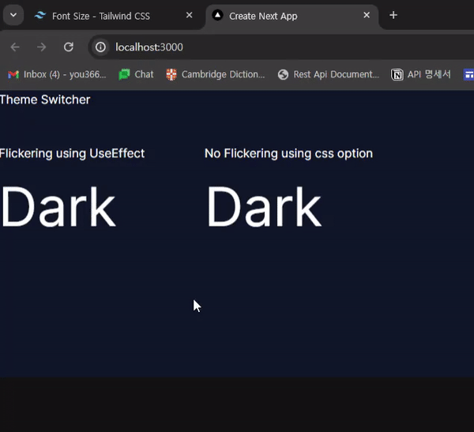

# Dark Mode Theme Switcher Without Flickering!

### Next.js(v14), Tailwind CSS, next-themes

There are a lot of example codes for dark mode switchers.

However, the switcher button flickers when refreshing because 'useTheme' and 'useEffect' are being used.
(You can see 'Light' first even thought the theme is dark.)

Just use the CSS 'display: none' and 'display: block' options like this example code!

